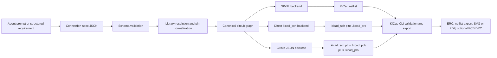
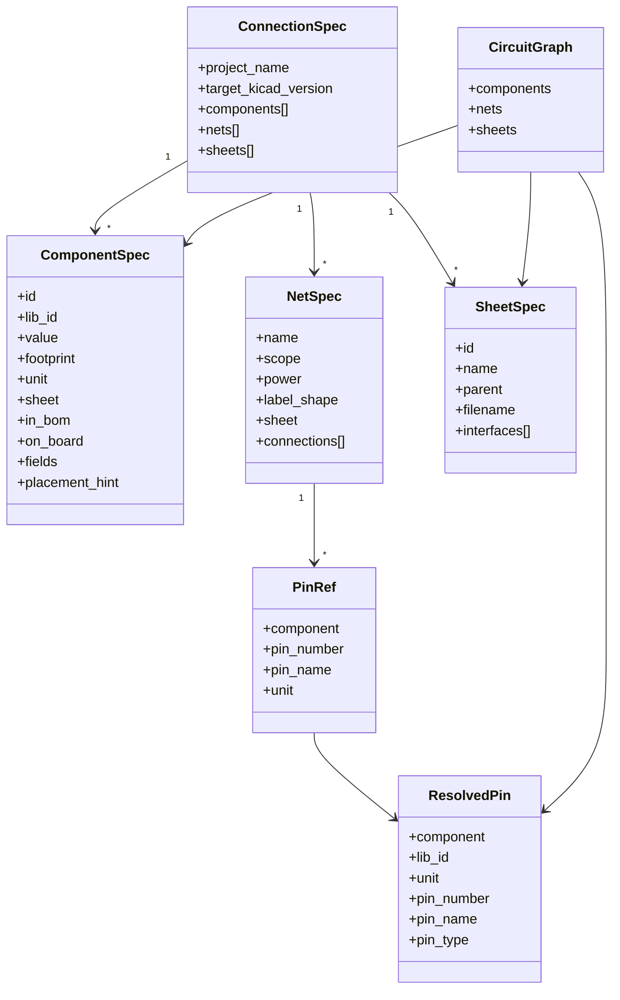

# Automating KiCad Schematic and Netlist Generation from AI Connection Specs

## Executive summary

The target KiCad version is unspecified. That matters, because the practical automation boundary is version-sensitive: modern KiCad projects revolve around `.kicad_sch`, `.kicad_pcb`, and `.kicad_pro`; legacy `.sch` is still readable but is converted to `.kicad_sch` on write; and the current official runtime APIs remain PCB-centric rather than schematic-centric. In KiCad’s own developer docs, Python bindings are officially supported for the PCB editor, not the rest of KiCad, and the newer IPC API is Protobuf-based but, in KiCad 9/10, only implemented for the PCB editor. By contrast, `kicad-cli` already gives you reliable command-line ERC, netlist export, BOM export, and schematic rendering/export. The immediate conclusion is blunt: if you want something practical now, build around deterministic file generation plus CLI validation, not around live Eeschema scripting. citeturn12view0turn6view3turn6view5turn25view2turn38view0

The best near-term architecture is a typed intermediate representation between the agent and KiCad: a strict connection-spec JSON or Protobuf, normalized into a canonical circuit graph, then emitted through one or more backends. For a fast MVP, the easiest backend is SKiDL, which is mature, library-aware, hierarchical, and good at generating KiCad netlists. For production-quality editable schematics, the strongest current path is direct `.kicad_sch` generation through a library such as `kicad-sch-api`, potentially via a JSON-centric layer similar to Circuit-Synth’s architecture. If you want TypeScript instead of Python, Circuit JSON plus `circuit-json-to-kicad` is a serious option, but it is broader and lower-level than most teams actually need for a connection-spec-first workflow. citeturn20view3turn20view4turn16view4turn34view6turn34view5turn15view5turn35view0

The hard parts are not “writing text files.” The hard parts are choosing stable identifiers, resolving pins against real symbol libraries, handling multi-unit parts and hierarchical sheets, carrying footprint intent cleanly, and deciding when a net should be expressed as a drawn wire, a local label, a global label, or a sheet pin. The other hard part is schematic readability: several current research efforts and field reports show that connectivity correctness and human-readable schematic layout are separate optimization problems, and higher-level code or typed IR tends to be a more reliable interface for AI than asking a model to synthesize raw netlists or raw schematic tokens end-to-end. citeturn7view1turn7view2turn8view0turn28view3turn23view1turn23view4turn24search2turn22view3turn30view0

My practical recommendation is therefore simple. Use a lean, agent-friendly connection spec as the contract. Implement two backends against the same canonical graph: SKiDL for rapid netlist-first output and direct `.kicad_sch` generation for the real deliverable. Let KiCad itself validate and export downstream artifacts. That gives you a deterministic system, readable diffs, and a path to incremental refinement instead of another black box. citeturn20view4turn16view4turn38view0

## KiCad primitives that matter

### Files, libraries, and portability

Modern KiCad projects expect at least a project file, a schematic, and a board design, all sharing the same base name. KiCad’s own manual says the important project artifacts are `.kicad_pro`, `.kicad_sch`, and `.kicad_pcb`. The project file contains settings shared between schematic and PCB; `.kicad_sch` contains symbol and connection information; and `.kicad_pcb` contains board information. KiCad also treats `.sch` and `.pro` as legacy formats that can be read and converted forward. citeturn12view0

KiCad’s modern design files are mostly text-based S-expressions. The developer file-format docs state that symbol libraries use `.kicad_sym`, schematics use `.kicad_sch`, boards use `.kicad_pcb`, and footprint libraries use `.pretty` directories containing `.kicad_mod` files. KiCad also documents packed and unpacked symbol libraries, plus project and global library tables via `sym-lib-table` and `fp-lib-table`. For automation, that means you should avoid hard-coded machine paths and prefer project-local library tables plus `${KIPRJMOD}` or versioned KiCad path variables. citeturn6view8turn6view1turn6view2turn12view0turn13view0

There are two small but important emitter details in the official format docs that are easy to miss. Third-party generators should not write `eeschema`, `pcbnew`, or `kicad_symbol_editor` into the `generator` field for `.kicad_sch`, `.kicad_pcb`, or `.kicad_sym`; KiCad explicitly asks generators to use their own identifier so generated-file bugs are not confused with native KiCad bugs. If you emit files directly, obey that. citeturn7view7turn6view2turn10view0

### Connectivity and hierarchy in `.kicad_sch`

KiCad’s schematic format is sheet-oriented: each schematic file is one sheet, and hierarchical designs are multiple sheet files under one root sheet. The official docs define root-sheet paths, UUID-based instance paths, and explicit `sheet` objects with sheet pins and per-project instances. That means a robust IR needs separate concepts for flat electrical connectivity and sheet-level connectivity. If you flatten too early, you lose reusable hierarchy; if you preserve only hierarchy, validation becomes harder. citeturn26view1turn7view7turn8view0

The schematic format also distinguishes local labels, global labels, and hierarchical labels. Local labels are sheet-local; global labels are visible across the design; hierarchical labels connect child sheets to parent sheets through matched sheet pins. Sheet pins also carry direction-like shapes such as `input`, `output`, `bidirectional`, `tri_state`, and `passive`. So an AI-facing connection spec should not treat every named net the same way. Some nets should be plain wires, some should be promoted to global labels, and some must be exposed through sheet interfaces. citeturn8view0turn7view1turn7view2turn7view7

A placed symbol instance in `.kicad_sch` carries a library identifier, placement, unit selection, BOM/board participation flags, a UUID, properties, and per-project instance data including the reference designator. The official format also states that `on_board` controls whether the associated footprint is exported to the board via the netlist. This matters for power symbols, virtual symbols, mounting hardware, and logical-only helpers. The KiCad netlist exporter’s own source documentation also notes that power symbols and other virtual symbols with references starting with `#` are handled specially when building pin lists. In practice, your IR should carry explicit `in_bom` and `on_board` intent instead of guessing from library names. citeturn8view0turn28view3turn26view0

### Netlists, board files, and official automation surfaces

KiCad still has netlist support, but its own docs are clear that netlist files are no longer required for the normal integrated schematic-to-board workflow. The manual defines a netlist as the representation used to pass connectivity between programs, and `kicad-cli sch export netlist` can emit multiple formats including `kicadsexpr`, `kicadxml`, `cadstar`, `orcadpcb2`, `spice`, `spicemodel`, `pads`, and `allegro`. KiCad’s doxygen docs additionally say the “KiCad netlist format supported by Pcbnew” is basically the XML netlist formatted slightly differently. For automation, that means writing a netlist is viable, but writing a schematic is the cleaner long-term target because KiCad itself can derive the rest from it. citeturn26view1turn6view4turn26view0

Board files are similarly well documented. The official board format docs say `.kicad_pcb` files contain sections for nets, footprints, tracks, zones, layers, properties, and more, and the section order is mostly non-critical apart from the header. This is good news for machine generation, but it does not change the bigger architectural point: today’s official runtime APIs still target the PCB editor, not Eeschema. KiCad’s developer docs state that the legacy SWIG bindings and Action Plugins are PCB-editor features, and the new IPC API is a stable, language-agnostic, Protobuf-based interface whose initial coverage was likewise focused on the PCB editor. Official `kicad-python` bindings exist for that IPC API, but schematic automation is still future roadmap, not current capability, in the published docs. citeturn6view2turn6view3turn6view5turn25view0turn25view2

## Candidate approaches

The table below compares the realistic ways to get from an AI-produced connection spec to something KiCad can consume today. The ratings are comparative judgments; the citations point to the underlying project docs and official KiCad behavior.

| approach | input format | ease for agents | fidelity to KiCad | tooling maturity | code examples available | estimated implementation effort |
|---|---|---:|---:|---:|---:|---:|
| SKiDL netlist-first. citeturn15view0turn20view4turn20view3turn30view0 | Python DSL, or JSON transformed to Python | High | Medium | High | Yes | Low |
| Direct `.kicad_sch` generation with `kicad-sch-api`. citeturn15view4turn16view4turn16view5 | Python object API, or custom JSON/graph backend | High | High | Medium | Yes | Medium |
| Circuit-Synth JSON hybrid. citeturn31view0turn34view6turn34view5turn34view3 | Python DSL plus canonical JSON | High | High | Medium | Yes | Medium |
| Circuit JSON plus `circuit-json-to-kicad`. citeturn35view0turn15view5turn15view6 | TypeScript/JSON array IR | Medium-High | Medium-High | Medium | Yes | Medium |
| `kiutils` or `kicad-skip` AST/file manipulation. citeturn18view0turn17view1turn19view0 | Existing KiCad files plus scripted mutations | Medium | High | Medium | Yes | Medium |
| Official KiCad API / plugin hybrid. citeturn6view3turn6view5turn25view0turn25view2 | SWIG `pcbnew`, IPC/Protobuf, plugin actions | Low for schematics | High for PCB, low for schematics today | Official but scope-limited | Yes | High |

The short read is even simpler than the table. If you want the shipping path with the least engineering friction, SKiDL is the best netlist-first backend. If you want editable modern KiCad schematics, direct `.kicad_sch` generation is the correct target, and `kicad-sch-api` is the most explicitly schematic-focused library I found. If your team is already TypeScript-heavy and comfortable with a richer CAD IR, Circuit JSON is worth serious consideration. If you want to patch or round-trip existing KiCad files rather than generate them from zero, `kiutils` and `kicad-skip` are more suitable than SKiDL. And if the idea was “maybe I should just automate Eeschema through the official API,” the answer from KiCad’s own docs is currently “not for schematics yet.” citeturn20view4turn16view4turn15view5turn18view0turn19view0turn6view3turn6view5

One adjacent tool is worth calling out separately: `KiPart`. It does not solve connectivity generation, but it is extremely useful if your agent starts from datasheet pin tables or CSV/Excel exports and you need to manufacture `.kicad_sym` libraries before you can wire anything. It supports multi-unit symbol generation, pin ordering, bundling of repeated power pins, and explicit standard properties such as Reference, Value, Footprint, and Datasheet. That makes it a practical preprocessor for library creation, not a full schematic generator. citeturn36view0turn36view1

## Recommended architecture

The most robust pattern is not “prompt the model to dump KiCad text.” It is “prompt the model to fill a strict circuit schema, normalize it into a canonical graph, then let deterministic code emit KiCad artifacts.” That recommendation is consistent with three different strands of evidence. First, KiCad’s own documented runtime automation surfaces are incomplete for schematics, so file generation is the stable path. Second, Circuit-Synth’s documented architecture already converged on a JSON-as-canonical-format model between Python definitions and KiCad files. Third, recent research and industry writeups point the same way: PCBSchemaGen uses an LLM-to-code-to-constraint-check loop, Schemato and EEschematic treat readable schematics as a separate synthesis problem from raw connectivity, and JITX’s own 2024 experiments found higher-level code more reliable than asking models to synthesize detailed raw netlists from scratch. citeturn6view5turn34view6turn23view1turn23view4turn24search2turn22view3



A good canonical model should be leaner than full Circuit JSON but richer than a bare netlist. Circuit-Synth’s published JSON schema is a useful reference point: it treats JSON as a canonical intermediate representation and models circuits in terms of components, pins, nets, subcircuits, and annotations. It also explicitly supports both legacy `pin_id` references and richer “pin object” references with number, name, and type. That is exactly the right lesson to borrow: your upstream contract should be compact, but your normalized internal model should preserve canonical pin identity plus aliases. citeturn34view6turn34view5turn34view1turn34view2turn34view3

### Sample JSON schema for a connection spec

The schema below is intentionally narrower than Circuit JSON. It is designed for authoring from an AI agent, not for representing every graphical detail of a finished schematic.

```json
{
  "$schema": "https://json-schema.org/draft/2020-12/schema",
  "title": "KiCadConnectionSpec",
  "type": "object",
  "required": ["version", "project", "components", "nets"],
  "properties": {
    "version": {
      "type": "string",
      "const": "0.1"
    },
    "project": {
      "type": "object",
      "required": ["name"],
      "properties": {
        "name": { "type": "string" },
        "target_kicad_version": { "type": ["string", "null"] },
        "root_sheet": { "type": "string", "default": "root" },
        "library_policy": {
          "type": "string",
          "enum": ["project-local", "global-ok"],
          "default": "project-local"
        }
      }
    },
    "components": {
      "type": "array",
      "items": {
        "type": "object",
        "required": ["id", "lib_id"],
        "properties": {
          "id": { "type": "string" },
          "lib_id": { "type": "string" },
          "value": { "type": "string" },
          "footprint": { "type": "string" },
          "unit": { "type": "integer", "minimum": 1 },
          "sheet": { "type": "string", "default": "root" },
          "in_bom": { "type": "boolean", "default": true },
          "on_board": { "type": "boolean", "default": true },
          "fields": {
            "type": "object",
            "additionalProperties": { "type": "string" }
          },
          "pin_aliases": {
            "type": "object",
            "additionalProperties": { "type": "string" }
          },
          "placement_hint": {
            "type": "object",
            "properties": {
              "x": { "type": "number" },
              "y": { "type": "number" },
              "rotation": { "type": "number" }
            }
          }
        }
      }
    },
    "nets": {
      "type": "array",
      "items": {
        "type": "object",
        "required": ["name", "connections"],
        "properties": {
          "name": { "type": "string" },
          "scope": {
            "type": "string",
            "enum": ["local", "global", "hierarchical"],
            "default": "local"
          },
          "power": { "type": "boolean", "default": false },
          "label_shape": {
            "type": "string",
            "enum": ["input", "output", "bidirectional", "tri_state", "passive"],
            "default": "passive"
          },
          "sheet": { "type": "string", "default": "root" },
          "connections": {
            "type": "array",
            "minItems": 2,
            "items": {
              "type": "object",
              "required": ["component"],
              "properties": {
                "component": { "type": "string" },
                "pin_number": { "type": "string" },
                "pin_name": { "type": "string" },
                "unit": { "type": "integer", "minimum": 1 }
              },
              "oneOf": [
                { "required": ["pin_number"] },
                { "required": ["pin_name"] }
              ]
            }
          }
        }
      }
    },
    "sheets": {
      "type": "array",
      "items": {
        "type": "object",
        "required": ["id", "name"],
        "properties": {
          "id": { "type": "string" },
          "name": { "type": "string" },
          "parent": { "type": ["string", "null"] },
          "filename": { "type": "string" },
          "interfaces": {
            "type": "array",
            "items": {
              "type": "object",
              "required": ["name"],
              "properties": {
                "name": { "type": "string" },
                "shape": {
                  "type": "string",
                  "enum": ["input", "output", "bidirectional", "tri_state", "passive"]
                }
              }
            }
          }
        }
      }
    }
  }
}
```

The design choice I would defend hardest is this one: inside your builder, canonical pin identity should be `(component_ref, unit, pin_number)`. Pin names are useful for agent ergonomics and datasheet matching, but they are not stable enough to be the primary key across multi-unit parts, bundled power pins, library variants, or different symbol representations. Circuit-Synth’s own schema support for both numeric pin IDs and richer pin objects makes the same point from another angle. citeturn34view2turn34view3turn36view0

### Minimal builder API design

```python
from dataclasses import dataclass, field
from typing import Literal

PinShape = Literal["input", "output", "bidirectional", "tri_state", "passive"]
NetScope = Literal["local", "global", "hierarchical"]
Backend = Literal["skidl", "kicad_sch", "circuit_json"]

@dataclass
class FieldMap:
    values: dict[str, str] = field(default_factory=dict)

@dataclass
class PlacementHint:
    x: float | None = None
    y: float | None = None
    rotation: float | None = None

@dataclass
class ComponentSpec:
    id: str
    lib_id: str
    value: str | None = None
    footprint: str | None = None
    unit: int = 1
    sheet: str = "root"
    in_bom: bool = True
    on_board: bool = True
    fields: FieldMap = field(default_factory=FieldMap)
    pin_aliases: dict[str, str] = field(default_factory=dict)
    placement_hint: PlacementHint = field(default_factory=PlacementHint)

@dataclass
class PinRef:
    component: str
    pin_number: str | None = None
    pin_name: str | None = None
    unit: int | None = None

@dataclass
class NetSpec:
    name: str
    connections: list[PinRef]
    scope: NetScope = "local"
    power: bool = False
    label_shape: PinShape = "passive"
    sheet: str = "root"

@dataclass
class SheetInterface:
    name: str
    shape: PinShape = "passive"

@dataclass
class SheetSpec:
    id: str
    name: str
    parent: str | None = None
    filename: str | None = None
    interfaces: list[SheetInterface] = field(default_factory=list)

@dataclass
class ConnectionSpec:
    project_name: str
    components: list[ComponentSpec]
    nets: list[NetSpec]
    sheets: list[SheetSpec] = field(default_factory=list)
    target_kicad_version: str | None = None

@dataclass
class ResolvedPin:
    component: str
    lib_id: str
    unit: int
    pin_number: str
    pin_name: str
    pin_type: str

@dataclass
class CircuitGraph:
    components: dict[str, ComponentSpec]
    nets: dict[str, list[ResolvedPin]]
    sheets: dict[str, SheetSpec]

def load_spec(path: str) -> ConnectionSpec: ...
def validate_schema(spec: ConnectionSpec) -> list[str]: ...
def index_symbol_libraries(sym_lib_table_path: str) -> dict[str, object]: ...
def resolve_pins(spec: ConnectionSpec, symbol_index: dict[str, object]) -> CircuitGraph: ...
def lint_connectivity(graph: CircuitGraph) -> list[str]: ...
def assign_references(graph: CircuitGraph) -> None: ...
def infer_labels_and_sheet_ports(graph: CircuitGraph) -> None: ...
def place_components(graph: CircuitGraph, mode: Literal["grid", "hinted", "none"]) -> None: ...
def emit_backend(graph: CircuitGraph, backend: Backend, out_dir: str) -> list[str]: ...
def run_kicad_validation(project_or_sch_path: str) -> dict[str, object]: ...
```

This API is intentionally boring. That is a virtue. The agent fills `ConnectionSpec`; deterministic code does validation, pin resolution, hierarchy handling, labeling policy, and backend emission. Do not bury library lookup, reference assignment, or footprint defaults inside one giant “generate schematic” function. Those are the parts you will want to test independently. That modular split is also consistent with Circuit-Synth’s documented Python → JSON → KiCad architecture and its separate schema documentation for components, nets, and pin reference formats. citeturn34view6turn34view5turn34view1turn34view2turn34view3



## Concrete implementation options

### Option A

Use a lean JSON connection spec, resolve symbols and pins against KiCad libraries, then emit SKiDL Python or construct SKiDL objects directly and let SKiDL generate the KiCad netlist. Use KiCad itself afterward for import, ERC, and any PCB synchronization. This is the fastest route to a working deterministic system because SKiDL already models circuits as code, supports hierarchy, can access KiCad libraries, and emits KiCad netlists for KiCad 5 through 9. Its own docs also make clear that current editable schematic generation is not the main mature path for modern KiCad; the schematic output is still described as KiCad V5-oriented in the project’s published material. citeturn20view4turn15view0turn30view0

The upside is speed and simplicity. The agent emits a small JSON document; your code turns that into Parts and Nets; SKiDL handles a lot of the library semantics; and you can immediately diff and test the result. The downside is equally clear: this is netlist-first, not schematic-first. If the real deliverable is a modern `.kicad_sch` that a human will keep editing in KiCad, this is an MVP, not the final architecture. I would estimate roughly **2–4 developer-days** for an MVP with schema validation, library resolution, netlist generation, and CLI-based ERC checks, assuming you stay within standard KiCad symbol libraries and postpone hierarchy auto-layout. Complexity is **low to medium**.

### Option B

Use the same lean JSON connection spec and canonical graph, but emit actual `.kicad_sch` files through `kicad-sch-api`. Then let `kicad-cli` derive netlists, BOMs, PDFs, SVGs, and ERC reports from those generated schematics. This is the cleaner long-term design because the schematic becomes the source artifact and KiCad itself produces the secondary outputs. `kicad-sch-api` is explicitly built for reading and writing `.kicad_sch`, preserving exact KiCad formatting, accessing real KiCad symbol libraries, and supporting hierarchy; it also advertises an MCP server for programmatic manipulation, which is directly relevant for agent workflows. citeturn16view4turn16view5turn16view1turn38view0

The upside is fidelity. You get real modern KiCad schematics, direct compatibility with KiCad tooling, and a much better story for round-trip editing. The downside is that you now own schematic layout policy, labeling policy, and hierarchy policy. The library already exposes connectivity analysis, but its own README also notes limitations around some global-label connectivity cases and incomplete ERC features. In other words: it is practical, but you still need to treat placement and “looks hand-drawn” quality as an algorithmic problem, not something the file format solves for you. I would estimate **1–2 developer-weeks** for a solid prototype with single-sheet generation, standard symbols, deterministic placement on a grid, and full CLI validation. Add another week or two for hierarchy, label placement, and cleaner routing heuristics. Complexity is **medium to high**. citeturn16view4turn16view5turn30view0

### Optional third path

If your engineering stack is TypeScript-first, use a lean connection spec upstream, then map it into Circuit JSON and feed `circuit-json-to-kicad`. This is credible, not gimmicky: Circuit JSON is explicitly designed as a low-level representation spanning schematic, PCB, BOM, Gerbers, simulation, warnings, and more, and the converter can generate `.kicad_sch`, `.kicad_pcb`, and `.kicad_pro`. The trade-off is that Circuit JSON is significantly broader than a connection-spec-only problem, so your team will spend time navigating a whole CAD IR instead of a narrowly scoped builder model. citeturn35view0turn15view5turn15view6

## Example code

The snippets below use a deliberately tiny sample spec: a voltage divider tied to a 1x3 header. That keeps the mechanics obvious and avoids power-symbol special cases in the code path.

### Sample JSON for the examples

```json
{
  "version": "0.1",
  "project": {
    "name": "divider_demo",
    "target_kicad_version": null
  },
  "components": [
    {
      "id": "J1",
      "lib_id": "Connector_Generic:Conn_01x03",
      "footprint": "Connector_PinHeader_2.54mm:PinHeader_1x03_P2.54mm_Vertical"
    },
    {
      "id": "R1",
      "lib_id": "Device:R",
      "value": "10k",
      "footprint": "Resistor_SMD:R_0603_1608Metric"
    },
    {
      "id": "R2",
      "lib_id": "Device:R",
      "value": "20k",
      "footprint": "Resistor_SMD:R_0603_1608Metric"
    }
  ],
  "nets": [
    {
      "name": "VIN",
      "connections": [
        { "component": "J1", "pin_number": "1" },
        { "component": "R1", "pin_number": "1" }
      ]
    },
    {
      "name": "VOUT",
      "connections": [
        { "component": "J1", "pin_number": "2" },
        { "component": "R1", "pin_number": "2" },
        { "component": "R2", "pin_number": "1" }
      ]
    },
    {
      "name": "GND",
      "connections": [
        { "component": "J1", "pin_number": "3" },
        { "component": "R2", "pin_number": "2" }
      ]
    }
  ]
}
```

### Python example using SKiDL to generate a KiCad netlist

This follows the documented SKiDL workflow: create `Part` and `Net` objects, connect them, run ERC, and call `generate_netlist(tool=KICAD9)`. The exact optional filename argument can vary slightly across releases, so the snippet sticks to the documented common path. citeturn20view4

```python
import json
from pathlib import Path
from skidl import Part, Net, ERC, generate_netlist, KICAD9

spec = json.loads(Path("divider_demo.json").read_text())

parts = {}
nets = {}

# Build components from KiCad lib_id strings like "Device:R".
for c in spec["components"]:
    lib_name, part_name = c["lib_id"].split(":", 1)
    p = Part(lib_name, part_name, ref=c["id"])
    if c.get("value"):
        p.value = c["value"]
    if c.get("footprint"):
        p.footprint = c["footprint"]
    parts[c["id"]] = p

# Build and connect nets.
for net_spec in spec["nets"]:
    net = Net(net_spec["name"])
    nets[net_spec["name"]] = net
    for conn in net_spec["connections"]:
        net += parts[conn["component"]][conn["pin_number"]]

# Optional sanity check, then write KiCad netlist output.
ERC()
generate_netlist(tool=KICAD9)
```

### Python example using `kicad-sch-api` to create a modern `.kicad_sch`

This follows the published `kicad-sch-api` usage pattern: create a schematic, add components, add wires or labels, then save. The exact helper method set may evolve with package version, so treat this as a minimal starting point rather than a frozen API contract. citeturn16view4turn16view1

```python
import json
import kicad_sch_api as ksa

spec = json.load(open("divider_demo.json", "r", encoding="utf-8"))

# Fixed placement for a minimal deterministic example.
positions = {
    "J1": (80.0, 90.0),
    "R1": (120.0, 80.0),
    "R2": (120.0, 100.0),
}

sch = ksa.create_schematic("divider_demo")

for c in spec["components"]:
    kwargs = {
        "lib_id": c["lib_id"],
        "reference": c["id"],
        "position": positions[c["id"]],
    }
    if c.get("value"):
        kwargs["value"] = c["value"]
    if c.get("footprint"):
        kwargs["footprint"] = c["footprint"]
    sch.components.add(**kwargs)

# Simple pin-to-pin wiring.
sch.add_wire_between_pins("J1", "1", "R1", "1")
sch.add_wire_between_pins("J1", "2", "R1", "2")
sch.add_wire_between_pins("J1", "2", "R2", "1")
sch.add_wire_between_pins("J1", "3", "R2", "2")

# Net labels make review easier.
sch.add_label("VIN", position=(95.0, 75.0))
sch.add_label("VOUT", position=(135.0, 90.0))
sch.add_label("GND", position=(95.0, 105.0))

sch.save("divider_demo.kicad_sch")
```

### Tiny pattern for a backend-agnostic builder layer

Do not let the agent write SKiDL or KiCad API calls directly if you can avoid it. Have it write the connection spec, then translate deterministically:

```python
def build_from_spec(spec: dict, backend: str):
    # 1) Validate schema and resolve pins.
    graph = resolve_pins(load_spec_dict(spec), index_symbol_libraries("sym-lib-table"))

    # 2) Assign stable references and label policy.
    assign_references(graph)
    infer_labels_and_sheet_ports(graph)

    # 3) Place only if the backend needs geometry.
    if backend in {"kicad_sch", "circuit_json"}:
        place_components(graph, mode="grid")

    # 4) Emit.
    return emit_backend(graph, backend=backend, out_dir="out/")
```

That split is what keeps the system testable. It also makes it trivial to add a second backend later without retraining or re-prompting the agent.

## Validation, edge cases, and next steps

### Edge cases you should encode explicitly

The first edge case is pin identity. Use pin numbers as the canonical key, and preserve pin names and electrical types as metadata or aliases. Multi-unit parts, repeated power pins, and symbols with bundled or duplicate names are exactly where naive “connect by pin name” logic falls apart. `KiPart`’s feature set is a good glimpse of why: it explicitly handles multi-unit symbols, pin-side arrangement, and bundling identically named power or ground pins. citeturn36view0

The second edge case is footprint intent. Do not infer footprints from symbol names unless you are in a carefully controlled template flow. KiCad’s symbol instances explicitly separate the library symbol from symbol properties and the `on_board` flag that controls whether the associated footprint participates in board export. If the connection spec is meant to produce a PCB-ready design, either require `footprint` in the schema or have a deterministic resolver stage with a project-maintained mapping table. citeturn28view0turn26view0

The third is net scope. KiCad distinguishes local labels, global labels, and hierarchical labels, and sheet pins must match hierarchical labels by name. A flat connection list cannot safely decide this after the fact unless it also knows sheet boundaries and interface intent. So the upstream IR should either carry `scope` explicitly or run a normalization phase that can infer it from hierarchy metadata. citeturn7view1turn7view2turn28view1

The fourth is UUID and instance-path stability. Direct KiCad file generators need stable UUID generation, especially for repeated sheet instances and symbols. KiCad’s schematic format uses UUIDs for the schematic root, symbols, sheets, labels, wires, and instance paths. If you want meaningful diffs across regenerations, generate UUIDs deterministically from stable object identities rather than calling random UUID functions blindly at every build. citeturn7view7turn8view0

The fifth is power and virtual symbols. KiCad’s exporter handles some power and virtual symbols specially, which is why power rails are not just ordinary two-pin components with a cute name. Your schema should represent power intent directly, even if your sample MVP uses ordinary connectors to keep the code simple. citeturn26view0

The last is schematic readability. Research and field reports converge on the same unpleasant truth: correct connectivity is the easy half, readable placement and routing is the hard half. Schemato and EEschematic are explicitly about converting connectivity into human-usable schematics, and the SKiDL schematic-generation post documents page anchoring, multi-unit handling, placement, routing, and wire beautification as substantial separate engineering work. JITX’s writeup reaches a similarly practical conclusion: higher-level code works better than raw detailed netlist synthesis for AI-assisted design. citeturn23view4turn24search2turn30view0turn22view3

### Suggested tests and validation steps

Use KiCad itself as the final judge. The CLI can run schematic ERC, export netlists, and emit SVG/PDF from a generated `.kicad_sch`; it can also run PCB DRC, including schematic-parity checks, on generated boards. That makes it suitable for local smoke tests and CI. citeturn38view0

I would use this validation stack:

- **Schema and semantic validation.** Validate the JSON against your schema, then verify that every `lib_id` resolves and every pin reference resolves to exactly one library pin.
- **Flattened connectivity golden test.** Convert the generated design to a normalized `(net_name, component_ref, unit, pin_number)` set and compare against expected fixtures.
- **Round-trip parse test.** If you emit netlists, parse them with `kinparse`; if you emit `.kicad_sch`, reload them with your chosen library (`kicad-sch-api`, `kiutils`, or `kicad-skip`) and verify the same canonical connectivity graph comes back. citeturn15view1turn18view0turn19view0turn16view4
- **KiCad ERC smoke test.** Run `kicad-cli sch erc generated.kicad_sch --format json --exit-code-violations`.
- **KiCad export smoke test.** Run `kicad-cli sch export netlist generated.kicad_sch -f kicadsexpr`, `kicad-cli sch export svg generated.kicad_sch`, and `kicad-cli sch export pdf generated.kicad_sch`.
- **Board parity test.** If you also emit a board, run `kicad-cli pcb drc generated.kicad_pcb --schematic-parity --format json`. citeturn38view0

A small but useful extra step is to open generated projects in a pinned KiCad baseline, save them once, then diff the result. If that first-save diff is huge, your emitter is probably leaving too much formatting, ordering, or property detail to chance. Libraries like `kicad-sch-api` and `kiutils` explicitly position themselves around exact or SCM-friendly file handling for exactly this reason. citeturn16view4turn17view3

### Next steps for prototyping

Start with a pinned KiCad compatibility target even though the user requirements leave it unspecified. I would pick **KiCad 8 or 9 semantics for generated project structure and CLI validation**, while avoiding any dependency on schematic IPC features that are not documented as supported today. citeturn12view0turn6view5turn38view0

Then build in this order:

1. **Implement the lean connection-spec schema and a symbol-library indexer.** Resolve `lib_id`, footprint, and canonical pin numbers first.
2. **Add an SKiDL backend.** This gets you useful output fast and forces you to nail the graph model before you worry about page aesthetics. citeturn20view4
3. **Add a direct `.kicad_sch` backend.** Use deterministic placement on a simple grid, plus labels instead of fancy routing, before attempting automatic “pretty” schematics. citeturn16view4turn30view0
4. **Wire in `kicad-cli` everywhere.** ERC, netlist export, SVG/PDF generation, and later PCB DRC. Treat CLI success as your compatibility gate. citeturn38view0
5. **Use project templates and project-local library tables.** KiCad explicitly supports templates with pre-seeded outlines, rules, drawing sheets, and starter schematics/boards; this is the cleanest way to keep auto-generated projects reproducible. citeturn13view0turn12view0
6. **Package repeated validated subcircuits as official KiCad design blocks or your own higher-level library.** KiCad’s project docs define design blocks as folders containing a `.kicad_sch`, a `.kicad_pcb`, and JSON metadata, which makes them a natural long-term packaging format once your generator stabilizes. citeturn12view0

The key prototype decision is this: **separate correctness from prettiness**. Get deterministic connectivity, symbol resolution, and validation working first. Only then spend time on schematic layout heuristics. That sequencing is where practical systems stop being demos and start being tools. citeturn23view1turn23view4turn22view3turn30view0

## Prioritized sources

The most useful sources for actually building this are the following:

- **KiCad Developer File-Format Docs** for `.kicad_sch`, `.kicad_pcb`, `.kicad_sym`, and the shared S-expression conventions. These are the primary references for direct file generation. citeturn6view0turn6view1turn6view2turn6view8
- **KiCad Manual and CLI Docs** for project structure, library tables, netlist position in the modern workflow, ERC, export commands, and validation in CI. citeturn12view0turn13view0turn26view1turn38view0
- **KiCad API Docs** for the current boundaries of official automation: SWIG `pcbnew`, Action Plugins, IPC, Protobuf, and official `kicad-python`. citeturn6view3turn6view5turn25view0turn25view2
- **SKiDL** for the fastest, most mature code-to-netlist path in Python. citeturn15view0turn20view4
- **`kicad-sch-api`** for direct modern schematic generation and agent-facing schematic manipulation. citeturn15view4turn16view4turn16view1
- **Circuit-Synth architecture and schema docs** for a production-style Python → JSON → KiCad design that already embodies the intermediate-representation pattern recommended here. citeturn34view6turn34view5turn34view1turn34view2
- **Circuit JSON and `circuit-json-to-kicad`** for a stronger TypeScript/JSON pipeline when you want a broader CAD IR than a simple connection spec. citeturn35view0turn15view5turn15view6
- **PCBSchemaGen, Schemato, EEschematic, and JITX’s 2024 writeup** for the most relevant recent evidence on where AI helps, where deterministic validation matters, and why higher-level representations beat free-form raw netlist synthesis. citeturn23view1turn23view4turn24search2turn22view3